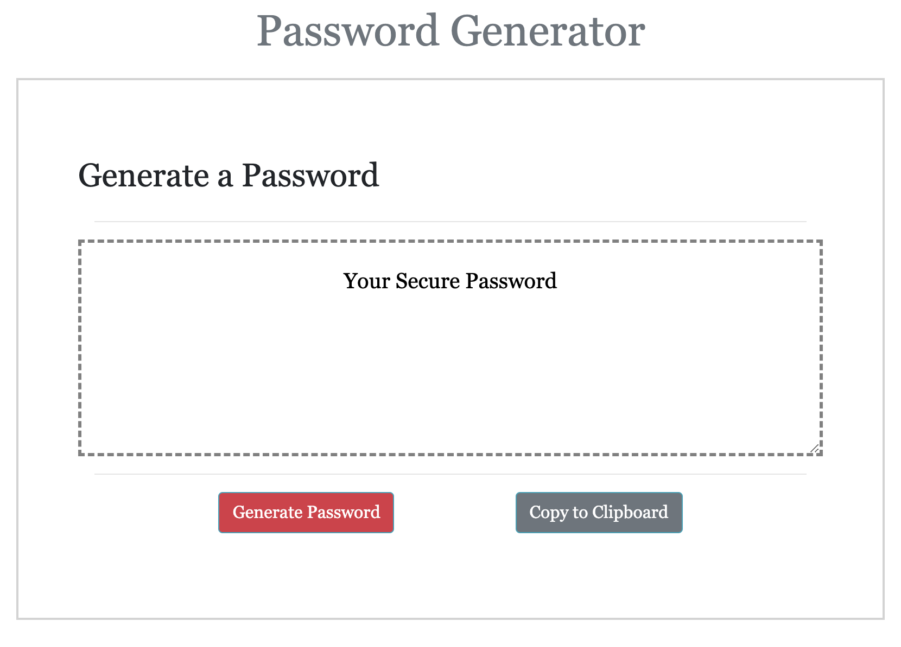
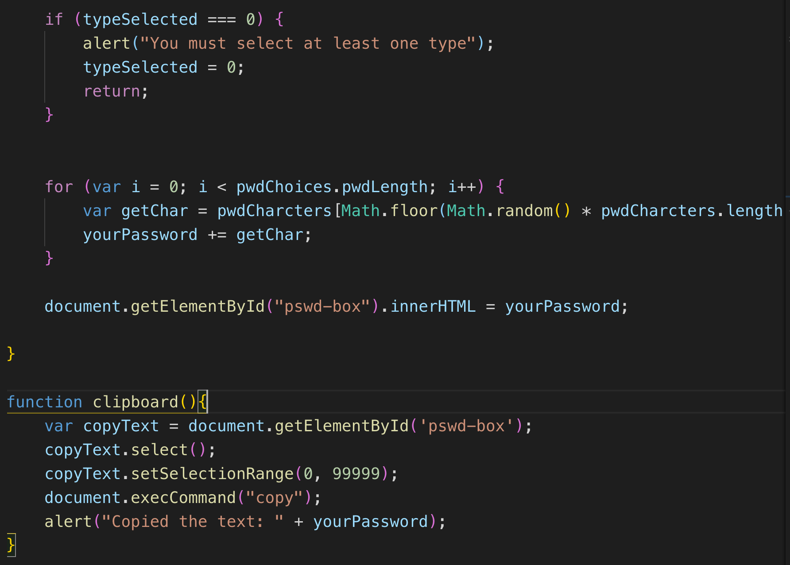
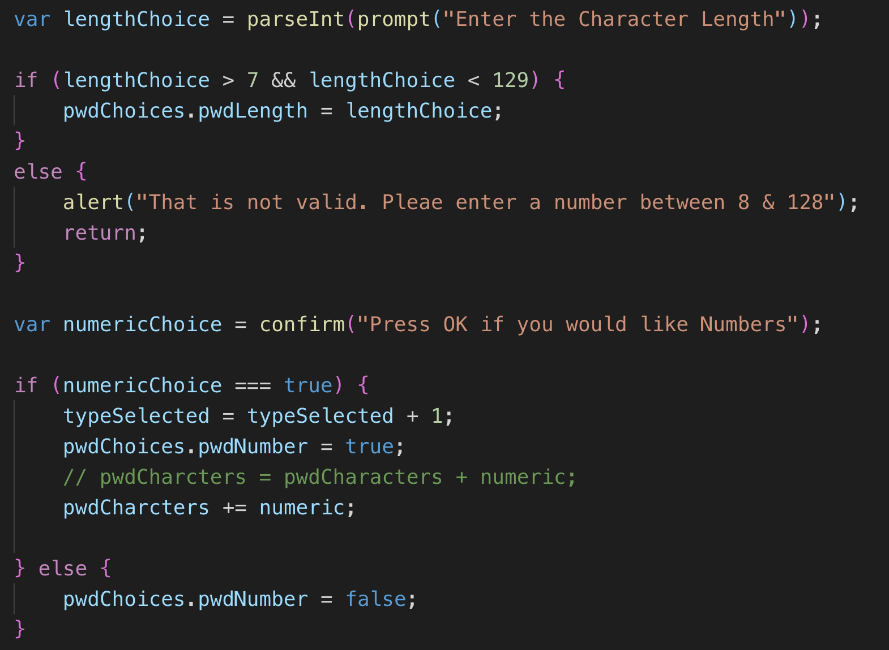

# Password Generator
---
This page will generate a random password based on the length and character options of your chosing.

Code Style
---
* HTML
* CSS
* Bootstrap Utilities

List of Files
---
* index.html
* style.css

Screen Shots
---

Code Examples
---

  

How To Use:
---

Click the Generate Password button.  
Follow the promts to determine your password length and the type of characters you would like included.

You must enter a lentgh from 8 to 128.
You can include numbers, uppercase letters, lowercase letters or special characters.  You must select a least one character type.

Your random password will appear in the text box.

If you need to copy your password, click the Copy to Clipboard button.

 Project source can be downloaded from (https://sharonyel.github.io/passwordgen/) 
 ---

License
---

MIT License

Copyright (c) [2019] [Sharon Yelverton]

Permission is hereby granted, free of charge, to any person obtaining a copy
of this software and associated documentation files (the "Software"), to deal
in the Software without restriction, including without limitation the rights
to use, copy, modify, merge, publish, distribute, sublicense, and/or sell
copies of the Software, and to permit persons to whom the Software is
furnished to do so, subject to the following conditions:

The above copyright notice and this permission notice shall be included in all
copies or substantial portions of the Software.

THE SOFTWARE IS PROVIDED "AS IS", WITHOUT WARRANTY OF ANY KIND, EXPRESS OR
IMPLIED, INCLUDING BUT NOT LIMITED TO THE WARRANTIES OF MERCHANTABILITY,
FITNESS FOR A PARTICULAR PURPOSE AND NONINFRINGEMENT. IN NO EVENT SHALL THE
AUTHORS OR COPYRIGHT HOLDERS BE LIABLE FOR ANY CLAIM, DAMAGES OR OTHER
LIABILITY, WHETHER IN AN ACTION OF CONTRACT, TORT OR OTHERWISE, ARISING FROM,
OUT OF OR IN CONNECTION WITH THE SOFTWARE OR THE USE OR OTHER DEALINGS IN THE
SOFTWARE.
